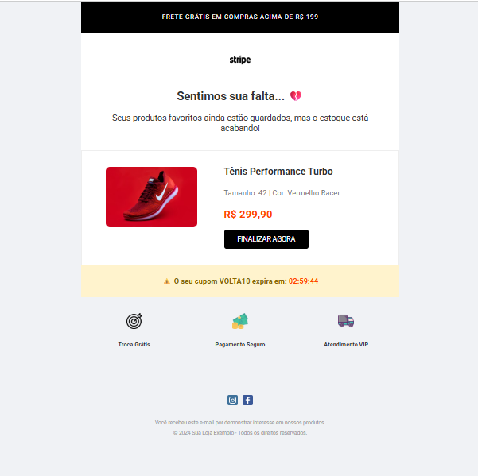

# 🛒 E-mail Marketing: Recuperação de Carrinho Abandonado | MJML & CRM
---
📸 **Preview do Projeto**
Este projeto simula uma das demandas mais críticas em agências de publicidade e e-commerces: a recuperação de vendas. O e-mail foi desenvolvido utilizando **MJML** para garantir que a oferta chegue de forma impecável ao cliente, independente do dispositivo ou gerenciador de e-mail utilizado.

---
🎯 **Objetivo do Projeto**
Reengajar usuários que não finalizaram a compra, utilizando gatilhos mentais e técnica visual:
* **Gatilho de Urgência:** Inclusão de cupom de desconto com tempo limitado.
* **Prova Social e Segurança:** Ícones de garantia de troca e pagamento seguro para quebrar objeções.
* **Foco em Produto:** Destaque visual para o item esquecido no carrinho.

---

🚀 **Tecnologias e Técnicas Utilizadas**
* **MJML:** Framework para codificação responsiva de alta performance.
* **mj-group:** Técnica avançada para manter elementos lado a lado (imagem e preço) em dispositivos móveis.
* **CSS Inline:** Otimização para motores de renderização como o Microsoft Outlook.
* **Gatilhos de CRM:** Estruturação de Call to Action (CTA) focada em conversão imediata.
* 
---

📱 **Diferenciais Técnicos**
1. **Mobile-First:** Design estruturado para leitura rápida em smartphones.
2. **Alta Entregabilidade:** Código limpo que evita filtros de spam.
3. **Pronto para Integração:** Estrutura compatível com **Salesforce Marketing Cloud**, **Brevo** e **HubSpot**.
   
---

## 🔗 Demonstração
Visualize o projeto finalizado:
* [Acessar E-mail de Carrinho Abandonado](https://diogo-netto.github.io/E-mail-Carrinho-Abandonado./)
  
---

**Desenvolvido por Diogo Netto** - Especialista em Front-end & Automação de Marketing.
